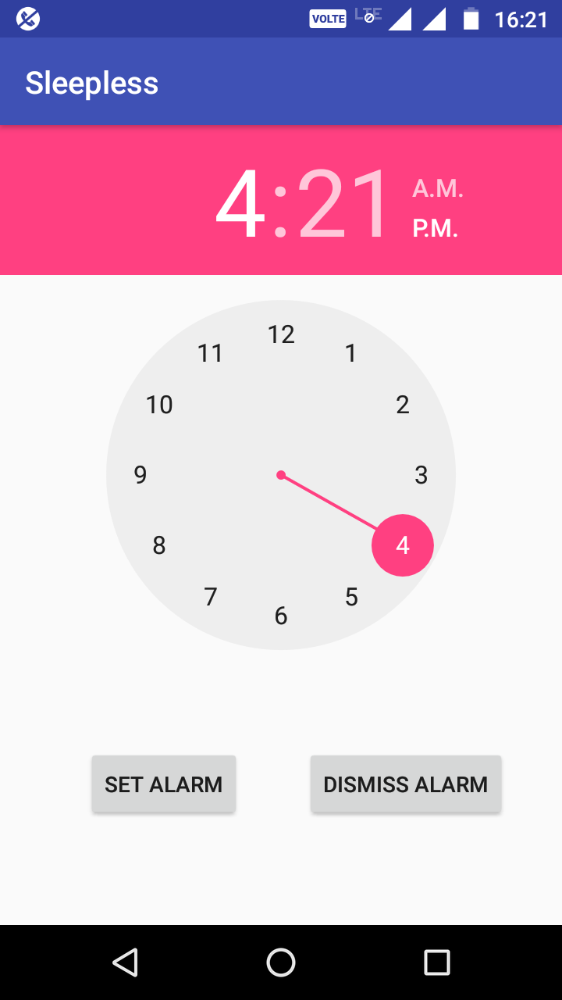

# Sleepless
A smart alarm system.
### Prerequisites
- Install Android studio
## Run
Import this project in android studio to make changes or to generate APK.
## Key Features
- Alarm can be stop only by solving a math question or by shaking the phone 40 times.
- Simple GUI,easy to use.

